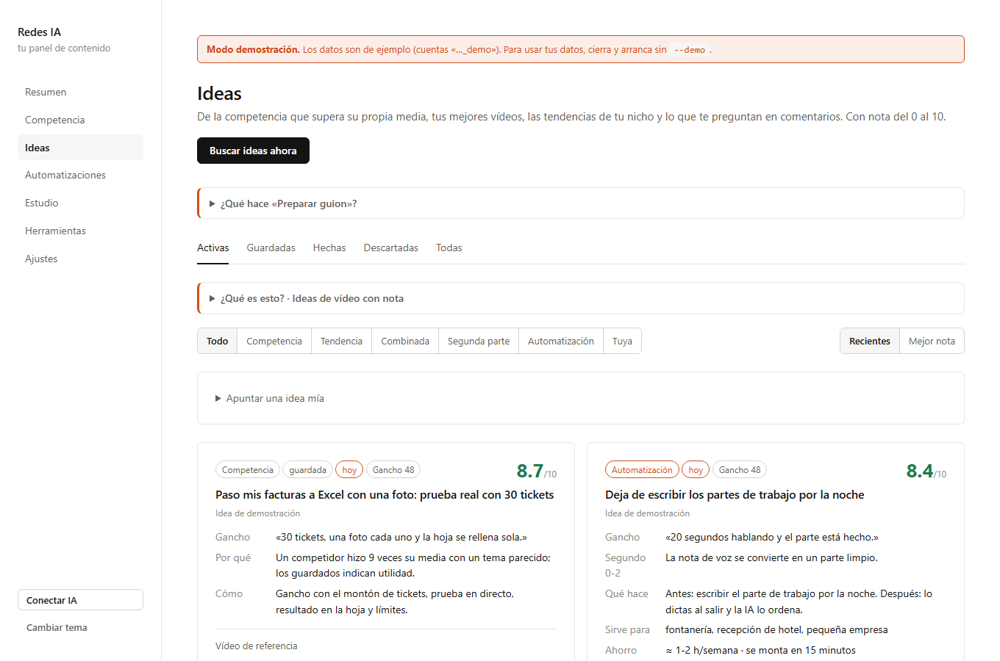
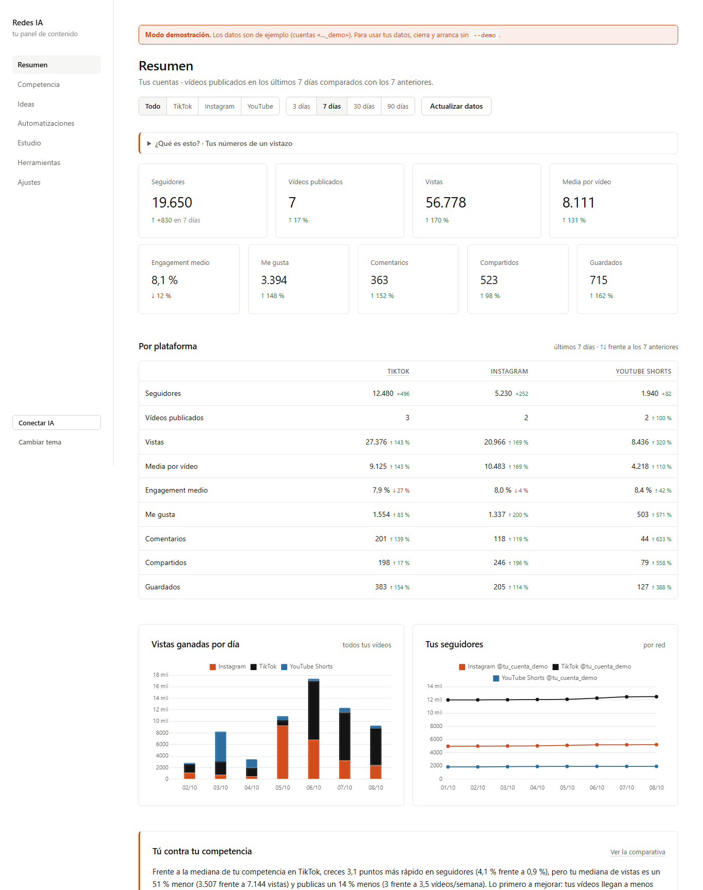
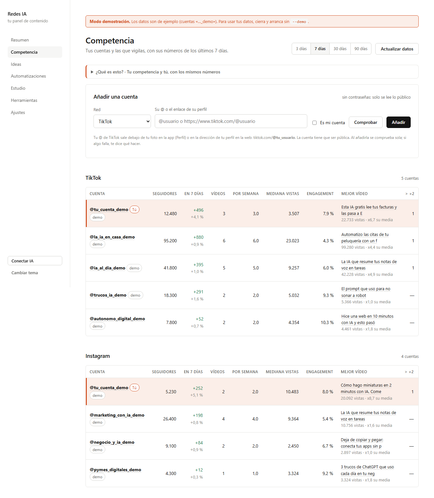
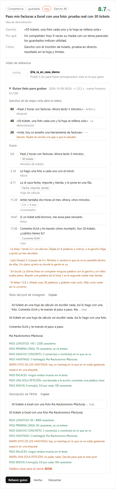
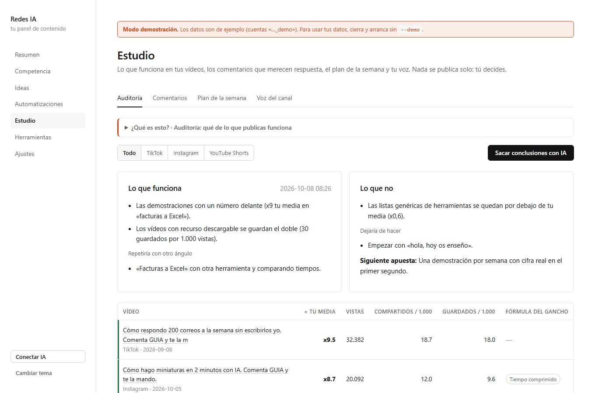

# Redes IA

**Tu panel de contenido para TikTok e Instagram, en tu ordenador y con tu propia clave de IA.**
Te dice qué funciona en tu nicho, te propone ideas con nota, te deja el guion listo para grabar con el gancho
puntuado y te ordena los comentarios que merecen respuesta. Gratis con Gemini, código abierto y sin servidores de
nadie: tus datos se quedan en tu ordenador.



## Qué hace

| | |
|---|---|
| **Resumen** | Seguidores, vistas, media por vídeo, **engagement**, me gusta, comentarios, compartidos y guardados en 3, 7, 30 o 90 días con ↑↓ frente al periodo anterior; tabla por plataforma, vistas ganadas por día, seguidores por red y tus mejores vídeos con portada. |
| **Competencia** | Tus cuentas y las que vigilas por red (TikTok, Instagram, YouTube): seguidores y su variación, vídeos por semana, mediana de vistas, engagement, mejor vídeo y vídeos de más de ×2 su mediana. Ficha de cada cuenta y comparativa **«Tú contra tu competencia»** con barras y una frase con qué mejorar primero. |
| **Ideas** | Busca los vídeos de tu competencia que **superan la media de su propia cuenta** (no las vistas brutas), tus vídeos que mejor funcionan, las tendencias de tu nicho (GitHub, Hacker News, Reddit) y lo que te preguntan en comentarios. Te propone ideas con nota del 0 al 10 y no repite las que ya tienes. |
| **Preparar guion** | Para cada idea: 3 ganchos **puntuados** con 26 fórmulas, el guion con tiempos frase a frase, el texto de Instagram y la descripción de TikTok revisados. Y lo corrige solo con los avisos de las herramientas hasta dos veces. |
| **Automatizaciones** | Cada lunes, 3 ideas de vídeo sobre automatizaciones con IA para trabajadores corrientes, fáciles de montar y con el guion por escenas. |
| **Estudio** | Auditoría de tus vídeos (múltiplo sobre tu media, compartidos y guardados por 1.000 vistas), comentarios clasificados con borrador de respuesta, plan de la semana y la «voz» de tu canal. |
| **Miniaturas** | Portadas para TikTok, Reels y YouTube **con tu cara**: escribes de qué va el vídeo, la IA propone el texto y crea la imagen en 5 estilos. En cada versión cambia el gesto, el ángulo y la ropa para que no salgas siempre igual. Con Gemini, OpenAI u OpenRouter (céntimos por imagen). |
| **Herramientas** | Puntuar ganchos, cronometrar un guion, revisar el texto del post, humanizar textos de IA y ranking viral. Sin IA y sin internet. |
| **Claude y Cursor** | Un servidor **MCP** y una **skill** en español para usarlo todo desde Claude Desktop, Claude Code, Cursor o cualquier cliente MCP. |

| Resumen | Competencia |
|---|---|
|  |  |
| **Guion listo para grabar** | **Estudio: auditoría** |
|  |  |

## Instalación en 3 pasos

Necesitas **Python 3.10 o superior** ([python.org/downloads](https://www.python.org/downloads/); en Windows marca
«Add python.exe to PATH»).

1. **Descárgalo**: botón verde **Code → Download ZIP** y descomprímelo (o `git clone https://github.com/iaquetrabaja/redes-ia`).
2. **Instálalo**: en Windows, doble clic en `instalar.bat`. En Mac o Linux, `./instalar.sh`.
3. **Ábrelo**: doble clic en `iniciar.bat` (o `./iniciar.sh`). Se abre solo en http://127.0.0.1:8765.

La primera vez te pide una IA (Gemini es gratis: [aistudio.google.com/apikey](https://aistudio.google.com/apikey))
y tu usuario de TikTok. ¿Quieres verlo antes? `iniciar-demo.bat` (o `./iniciar.sh --demo`) lo abre con datos de ejemplo.

La guía paso a paso, con capturas, para quien no ha instalado nunca nada: **[docs/GUIA.md](docs/GUIA.md)**.

## Las IAs que puedes usar

| Proveedor | Coste | Para qué |
|---|---|---|
| **Google Gemini** | Gratis (con límites diarios) | Lo recomendado para empezar. |
| OpenAI (ChatGPT) | De pago por uso, céntimos al día | Si ya tienes clave. |
| Anthropic (Claude) | De pago por uso | Escribe muy bien en español. |
| OpenRouter | De pago por uso | Cientos de modelos con una sola clave. |
| Ollama | Gratis, en tu ordenador | Sin internet para la IA; necesita un ordenador potente. |

## Conectar tus redes

- **TikTok**: solo tu @ y los de tu competencia, en **Competencia**. Pulsa **«Comprobar»** y verás al momento tu
  nombre, seguidores y últimos vídeos, o qué falla y qué hacer (@ mal escrito, cuenta privada, sin vídeos públicos,
  TikTok frenando). Se leen los datos públicos **sin contraseña**: los ~10 últimos vídeos de cada cuenta con sus vistas
  y, en los tuyos, me gusta, compartidos, guardados y comentarios.
- **Instagram**: tu cuenta profesional con la **API oficial** de Instagram (token que se renueva solo). La guía lo
  explica pantalla a pantalla. La competencia de Instagram, a mano o por CSV (Instagram no da datos de cuentas ajenas
  con ese token; si tienes token de Facebook, también por Business Discovery).
- **YouTube Shorts** (opcional): canales propios o de referencia.

## Desde Claude, Cursor y similares

En **Ajustes → Claude y Cursor** tienes la configuración lista para copiar, con las rutas de tu ordenador.

```json
{ "mcpServers": { "redes-ia": { "command": "<tu python>", "args": ["<ruta>/redes-ia/mcp_redes.py"] } } }
```

- **Claude Code**: `claude mcp add redes-ia -- python /ruta/redes-ia/mcp_redes.py`
- **Skill** (13 modos en español): copia `skills/redes` a `~/.claude/skills/redes`.

Herramientas MCP: `puntuar_gancho`, `ranking_ganchos`, `formulas_gancho`, `hoja_de_ritmo`, `revisar_pie`,
`humanizar`, `detectar_ia`, `ranking_viral`, `ideas_recientes`, `auditoria`, `comentarios_pendientes`,
`voz_del_canal`, `plan_semanal` y `preparar_guion`.

## Privacidad

- La app solo escucha en `127.0.0.1`: nadie de fuera de tu ordenador puede abrirla.
- Tus datos y claves viven en la carpeta `datos/` (fuera de git). Para hacer copia, copia esa carpeta.
- A tu proveedor de IA solo se envía lo necesario para generar: textos de vídeos, comentarios y tu «voz».
- Sin analítica, sin cookies de terceros y sin cargar nada de fuera.

## Lo que no hace (y por qué)

- **No publica ni manda mensajes por ti.** Todo son borradores. Automatizar publicaciones, comentarios o mensajes
  con un navegador va contra las condiciones de TikTok e Instagram y acaba en bloqueos.
- **No lee cuentas ajenas de Instagram** sin el permiso adecuado (ver arriba).
- **TikTok sin login** da los ~10 últimos vídeos de cada cuenta. Suficiente para ver qué funciona ahora, no para
  estudiar años de historia. Si TikTok cambia su web, puede fallar hasta que se actualice.
- **La nota del gancho caza los ganchos flojos; no adivina cuál será viral.** Eso lo deciden tu cara, tu edición y
  el algoritmo. El detector de «suena a IA» es heurístico y local, no un servicio externo.

## Para desarrolladores

```bash
python -m redes_ia --demo           # datos de ejemplo en datos/demo
python -m unittest discover -s tests
python -m redes_ia.mcp_server       # servidor MCP por stdio
```

Estructura: `redes_ia/` (app FastAPI, colectores, servicios, MCP), `skills/redes/` (la skill y sus herramientas en
Python sin dependencias), `docs/` (guía y capturas), `tests/`.

## Créditos

Hecho por **David García** ([IA que trabaja](https://iaquetrabaja.com)). La skill de redes es una adaptación al
español y a TikTok de [instagram-agent-skill](https://github.com/Jakeschincariol/instagram-agent-skill) de Jake
Schincariol (MIT). Licencia MIT.
