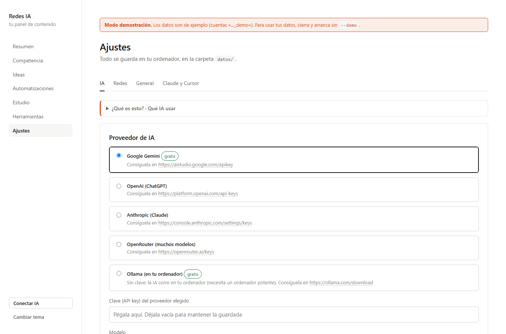
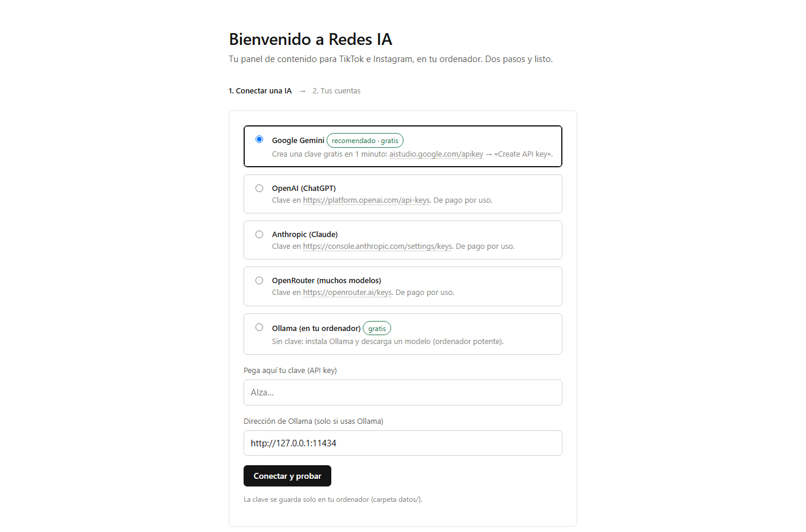
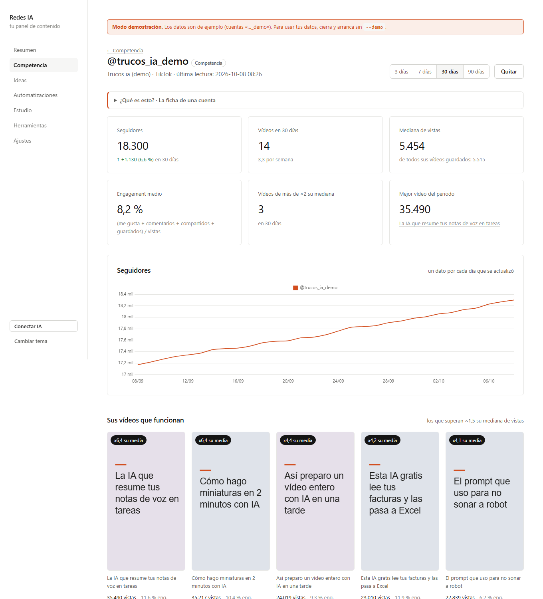
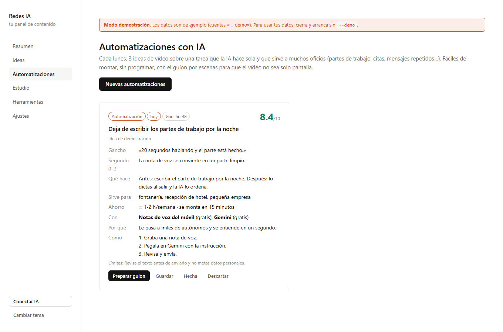
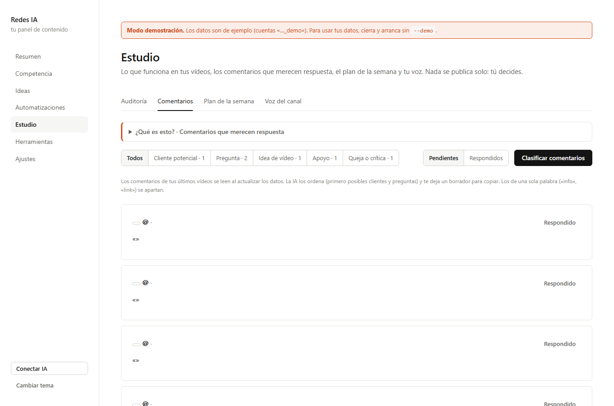
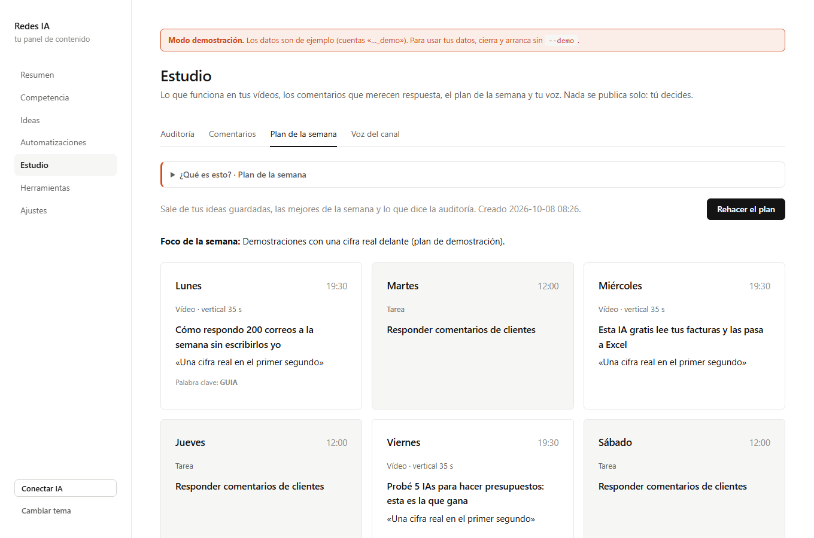
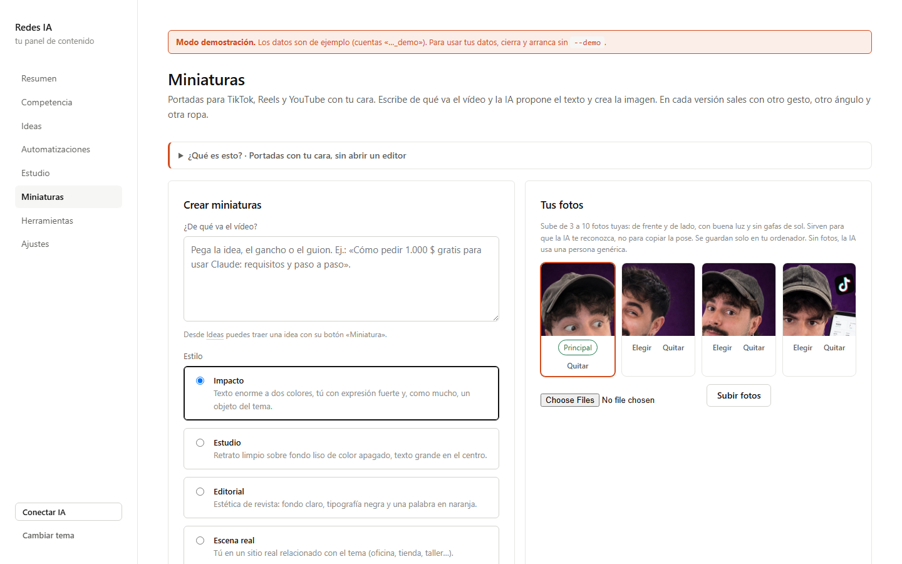
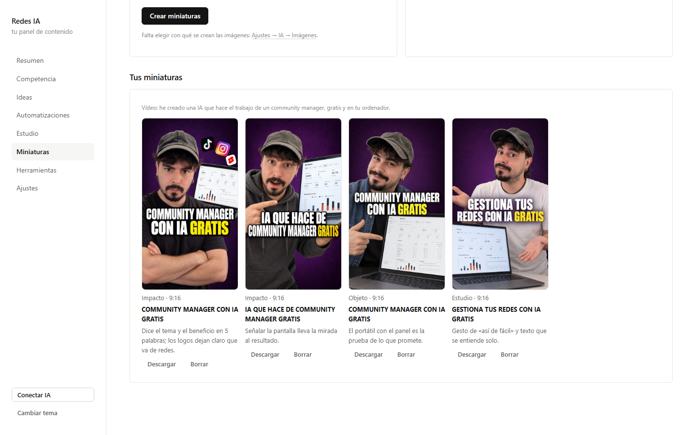
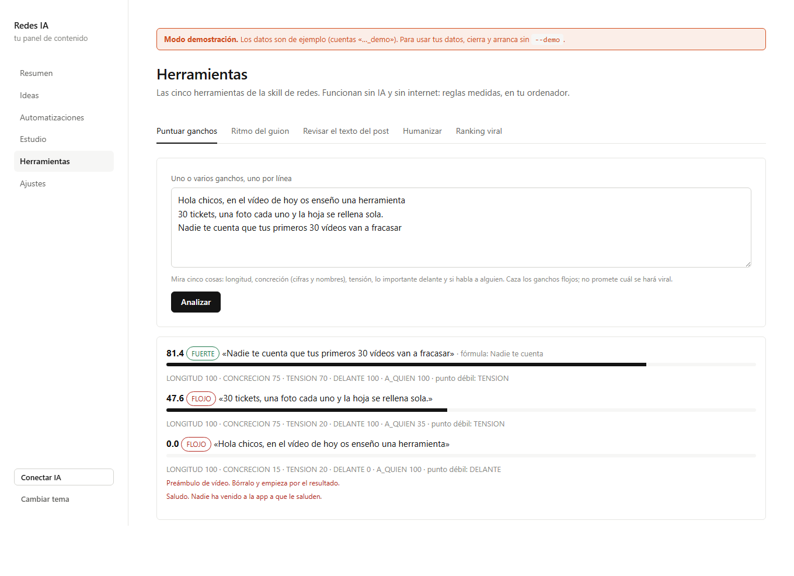
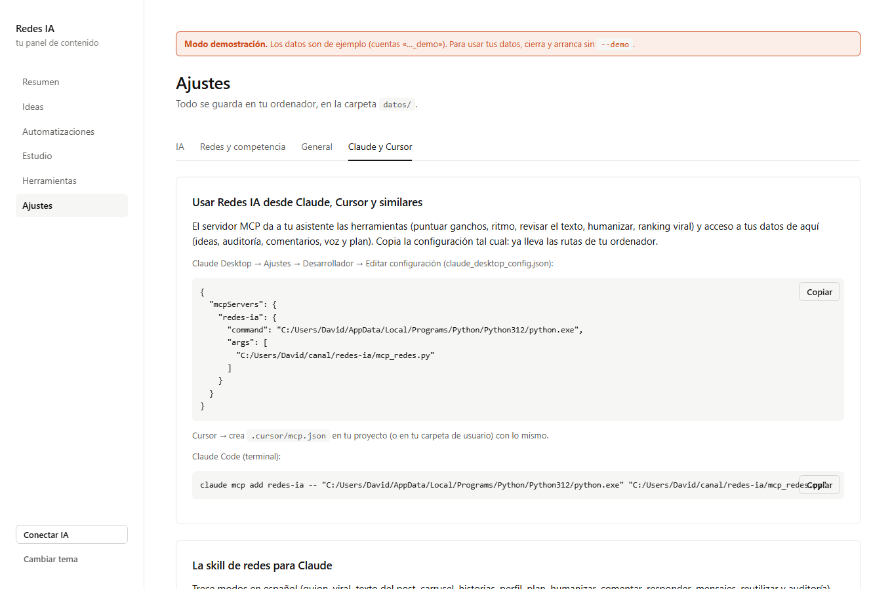

# Guía completa de Redes IA

Esta guía está pensada para alguien que **no ha instalado nunca un programa desde GitHub**. Si ya sabes, salta a
lo que necesites con el índice.

1. [Qué es y qué necesitas](#1-qué-es-y-qué-necesitas)
2. [Instalar Python](#2-instalar-python)
3. [Descargar Redes IA](#3-descargar-redes-ia)
4. [Instalar y abrir](#4-instalar-y-abrir)
5. [Conseguir tu clave GRATIS de Gemini](#5-conseguir-tu-clave-gratis-de-gemini)
6. [Otras IAs y lo que cuestan](#6-otras-ias-y-lo-que-cuestan)
7. [Primer arranque](#7-primer-arranque)
8. [Conectar TikTok y tu competencia](#8-conectar-tiktok-y-tu-competencia) (con «Comprobar»)
9. [Conectar Instagram (API oficial)](#9-conectar-instagram-api-oficial)
10. [YouTube Shorts](#10-youtube-shorts)
11. [Usar cada sección](#11-usar-cada-sección)
12. [Usarlo desde Claude Desktop, Claude Code y Cursor](#12-usarlo-desde-claude-desktop-claude-code-y-cursor)
13. [Tareas automáticas](#13-tareas-automáticas)
14. [Copias de seguridad, actualizar y desinstalar](#14-copias-de-seguridad-actualizar-y-desinstalar)
15. [Problemas frecuentes](#15-problemas-frecuentes)
16. [Privacidad](#16-privacidad)
17. [Límites honestos](#17-límites-honestos)

---

## 1. Qué es y qué necesitas

Redes IA es una página web que funciona **dentro de tu ordenador** (no en internet). La abres en tu navegador y te
ayuda a decidir qué publicar en TikTok e Instagram y cómo: ideas con nota, guiones con el gancho puntuado,
comentarios que merecen respuesta y qué está funcionando en tu nicho.

Necesitas:

- Un ordenador con **Windows 10/11, macOS o Linux**. No hace falta que sea potente (salvo que uses Ollama).
- **Python 3.10 o superior** (gratis; el paso 2 explica cómo).
- Una **clave de IA**. La de **Google Gemini es gratis** y sirve de sobra para empezar.
- Tu usuario de **TikTok** y, si quieres, tu **Instagram profesional**.

No necesitas saber programar ni pagar nada.

## 2. Instalar Python

### Windows

1. Entra en **https://www.python.org/downloads/**. Verás un botón amarillo grande: **«Download Python 3.x.x»**. Púlsalo.
2. Abre el archivo que se ha descargado (`python-3.x.x-amd64.exe`).
3. **Muy importante:** abajo del todo de la primera ventana hay una casilla **«Add python.exe to PATH»**. Márcala.
4. Pulsa **«Install Now»** y espera a que termine. Si Windows pregunta si permites cambios, di que sí.
5. Al final aparece **«Setup was successful»**. Pulsa **Close**.

Para comprobarlo: pulsa la tecla Windows, escribe `cmd`, abre «Símbolo del sistema» y escribe `python --version`.
Debe responder algo como `Python 3.12.7`.

### Mac

1. Entra en **https://www.python.org/downloads/** y pulsa **«Download Python 3.x.x»** (es un `.pkg`).
2. Ábrelo y sigue el instalador (Continuar → Aceptar → Instalar). Te pedirá la contraseña del Mac.
3. Al acabar se abre una carpeta; puedes cerrarla.

Comprueba en **Terminal** (búscalo con Cmd+Espacio): `python3 --version`.

### Linux (Ubuntu, Debian…)

```bash
sudo apt update && sudo apt install -y python3 python3-venv
```

## 3. Descargar Redes IA

**Opción fácil (ZIP):**

1. Entra en la página del proyecto en GitHub.
2. Pulsa el botón verde **«Code»** y luego **«Download ZIP»**.
3. Ve a tu carpeta de Descargas, haz clic derecho en `redes-ia-main.zip` → **«Extraer todo…»** (en Mac basta con
   hacer doble clic).
4. Mueve la carpeta que sale (`redes-ia-main`) a un sitio cómodo, por ejemplo **Documentos**. No la dejes dentro de
   la carpeta comprimida.

**Opción con git** (si lo tienes): `git clone https://github.com/iaquetrabaja/redes-ia`

## 4. Instalar y abrir

### Windows

1. Abre la carpeta de Redes IA.
2. Haz **doble clic en `instalar.bat`**. Se abre una ventana negra que descarga lo necesario (1-2 minutos, solo la
   primera vez). Cuando ponga **«Listo»**, pulsa una tecla.
   - Si Windows muestra «Windows protegió su PC», pulsa **«Más información» → «Ejecutar de todas formas»**. Es un
     archivo de texto con las órdenes de instalación; puedes abrirlo con el Bloc de notas para verlo.
3. Haz **doble clic en `iniciar.bat`**. Se abre otra ventana negra y, a los pocos segundos, tu navegador en
   **http://127.0.0.1:8765**.

**Deja esa ventana negra abierta mientras usas Redes IA.** Si la cierras, se cierra la app.

### Mac y Linux

1. Abre **Terminal** y entra en la carpeta (escribe `cd ` con un espacio y arrastra la carpeta a la ventana; pulsa Intro).
2. La primera vez: `chmod +x instalar.sh iniciar.sh && ./instalar.sh`
3. Para abrirla: `./iniciar.sh`

### Verlo con datos de ejemplo

¿Quieres verlo antes de conectar nada? Abre **`iniciar-demo.bat`** (o `./iniciar.sh --demo`). Verás todo con datos
inventados y marcados como demo. No toca tus datos reales (van en `datos/demo`).

### Con Docker (opcional, para quien lo use)

```bash
docker compose up -d     # y abre http://127.0.0.1:8765
```

## 5. Conseguir tu clave GRATIS de Gemini

1. Entra en **https://aistudio.google.com/apikey** e inicia sesión con tu cuenta de Google.
2. La primera vez te pide aceptar las condiciones de Google AI Studio. Acéptalas.
3. Pulsa **«Create API key»** («Crear clave de API»).
4. Si te pregunta por un proyecto, elige el que te propone o **«Create API key in new project»**.
5. Aparece una clave larga que empieza por **`AIza…`**. Pulsa **«Copy»**.
6. Pégala en Redes IA (paso 7). No la compartas con nadie: es como una contraseña.

**Lo que tienes que saber del plan gratuito:**

- Tiene límites por minuto y por día. Para un canal normal sobran; si un día se acaba, Redes IA te lo dice («429») y
  al día siguiente vuelve a funcionar.
- En el plan gratuito, Google puede usar lo que envías para mejorar sus productos. Si eso te importa, activa la
  facturación en Google AI Studio (pasas al plan de pago, céntimos al mes con este uso) o usa otra IA.

## 6. Otras IAs y lo que cuestan

| Proveedor | Dónde se consigue la clave | Coste aproximado con Redes IA |
|---|---|---|
| Google Gemini | aistudio.google.com/apikey | **0 €** con el plan gratuito |
| OpenAI | platform.openai.com/api-keys (hay que añadir saldo) | 1-5 € al mes con un modelo «mini» |
| Anthropic (Claude) | console.anthropic.com/settings/keys | 2-8 € al mes con Haiku o Sonnet |
| OpenRouter | openrouter.ai/keys | Según el modelo; hay alguno gratuito |
| Ollama | ollama.com/download (en tu ordenador) | 0 €; necesita un ordenador potente y descargar un modelo (`ollama pull llama3.1`) |

Los costes son orientativos: dependen de cuántas ideas y guiones generes. Las **miniaturas** (imágenes) se pagan aparte: unos céntimos por imagen con Gemini, OpenAI u OpenRouter. Cada proveedor tiene un panel donde ves el
gasto.

Puedes cambiar de IA cuando quieras en **Ajustes → IA**. El botón **«Ver modelos disponibles»** muestra los modelos
de tu clave y **«Guardar y probar conexión»** comprueba que funciona.



## 7. Primer arranque

La primera vez que abres Redes IA aparece un asistente de dos pasos:



1. **Conectar una IA**: elige Gemini (o la que tengas), pega la clave y pulsa «Conectar y probar». Si algo falla, te
   dice qué: clave mal copiada, límite de uso, etc.
2. **Tus cuentas**: tu usuario de TikTok, entre 3 y 10 cuentas de referencia de tu nicho y una frase de qué va tu
   canal. Pulsa «Empezar»: se leen los vídeos (tarda un par de minutos) y llegas al Resumen.

## 8. Conectar TikTok y tu competencia

TikTok se conecta **solo con tu @**. No hay que iniciar sesión, ni dar contraseñas, ni instalar nada en el móvil:
Redes IA lee lo mismo que ve cualquiera que abre tu perfil sin cuenta. **Nunca te pedirá tu contraseña**; si algo
te la pide, no es Redes IA.

### 8.1 Encuentra tu @ exacto

Es el nombre de usuario, **no** el nombre que se ve en grande. Sin espacios ni tildes: solo letras, números, puntos y
guiones bajos.

- **En la app (móvil)**: abajo a la derecha, **Perfil**. Tu @ está justo debajo de tu foto (por ejemplo
  `@maria.ia_trucos`). También puedes pulsar **☰ → Ajustes y privacidad → Cuenta → Información de la cuenta** o
  **Compartir perfil → Copiar enlace**.
- **En la web (ordenador)**: entra en [tiktok.com](https://www.tiktok.com), pulsa **Perfil** en el menú de la
  izquierda y mira la barra de direcciones: `https://www.tiktok.com/@maria.ia_trucos`. Lo que va detrás de la @ es tu
  usuario.

Vale cualquiera de las tres formas: `@maria.ia_trucos`, `maria.ia_trucos` o el enlace completo del perfil (también
el enlace de uno de tus vídeos). Los enlaces cortos tipo `vm.tiktok.com/…` no valen: ábrelos y copia el de la barra.

### 8.2 La cuenta tiene que ser pública

TikTok no enseña los vídeos de una cuenta privada a nadie, tampoco a Redes IA. Para comprobarlo: **Perfil → ☰ →
Ajustes y privacidad → Privacidad → «Cuenta privada»** tiene que estar **desactivado**. Los vídeos que tengas en
«Solo yo» o «Amigos» tampoco se ven.

### 8.3 Añádela y comprueba que funciona

En **Competencia → Añadir una cuenta**:

1. **Red**: TikTok.
2. **Su @ o el enlace de su perfil**: tu @.
3. Marca **«Es mi cuenta»** (solo en la tuya).
4. Pulsa **«Comprobar»**. En unos segundos verás una de estas dos cosas:
   - En verde: **«Funciona: @tu_usuario (Tu nombre), 10 vídeos leídos»**, tus seguidores y tus últimos vídeos con
     sus vistas. Está bien conectado: pulsa **«Añadir»**.
   - En rojo, **qué pasa y qué hacer**: el @ no existe (está mal escrito), la cuenta es privada, no tiene vídeos
     públicos, TikTok está frenando las lecturas o no hay conexión. Corrígelo y vuelve a comprobar.
5. Al pulsar «Añadir» se comprueba otra vez, por si acaso. Si el @ no existe o es privada, **no se guarda** y te dice
   por qué. Si TikTok solo está frenando, se guarda y se lee en la próxima actualización.

Repite con las cuentas de tu competencia (sin marcar «Es mi cuenta»).


### 8.4 Cómo saber que va bien

- En **Competencia**, tu fila sale resaltada con la etiqueta **«Tú»**, con seguidores y vídeos. Si hay un problema,
  debajo del @ aparece el error en rojo.
- En **Resumen** ves tus vistas y tus vídeos. Los seguidores y las «vistas ganadas por día» necesitan **dos días**
  de datos para dibujar la curva: el primer día solo hay un punto.
- En **Ajustes → General → Historial de tareas**, la tarea `datos` dice cuántos vídeos leyó de cada cuenta.

### 8.5 Qué se lee y por qué solo eso

- De cada cuenta: seguidores y sus **~10 últimos vídeos** con las vistas. Es lo que TikTok enseña en la página
  pública de «insertar perfil» (la que usan las webs para mostrar un TikTok). Para ver más hacia atrás haría falta
  iniciar sesión o simular un navegador, y eso va contra las normas de TikTok y acaba en bloqueos.
- Como cada día se guardan los vídeos nuevos, **con las semanas tendrás todo tu historial** desde que empezaste a
  usar Redes IA.
- De **tus** vídeos, además: me gusta, comentarios, compartidos, guardados y los comentarios de tus 5 últimos vídeos.
- De la **competencia**: me gusta, comentarios, compartidos y guardados de sus vídeos del último mes (como mucho cada
  3 días), para poder calcular su engagement y compararte.
- Va despacio a propósito: pocas peticiones, con pausas y reintentos suaves.

### 8.6 Cómo elegir la competencia

Cuentas de tu mismo tema y tamaño parecido o algo mayor (entre 3 y 10). Las ideas salen de sus vídeos que **superan
la media de su propia cuenta**: así un vídeo de 50.000 vistas en una cuenta que suele hacer 5.000 cuenta más que uno
de 500.000 en una cuenta que suele hacer 1 millón.

## 9. Conectar Instagram (API oficial)

Instagram solo deja leer datos con su **API oficial**. Es gratis, pero tiene unos cuantos pasos. Se hace una vez.

### 9.1 Pasa tu cuenta a profesional

En la app de Instagram: **tu perfil → menú ☰ → Configuración y actividad → Tipo de cuenta y herramientas → Cambiar a
cuenta profesional**. Elige **Creador** o **Empresa** (las dos valen).

### 9.2 Crea una app en Meta para desarrolladores

1. Entra en **https://developers.facebook.com** e inicia sesión con tu Facebook (si no tienes cuenta de
   desarrollador, te pide registrarte: acepta y verifica tu teléfono o correo).
2. Arriba, **«Mis apps» → «Crear app»**.
3. Nombre de la app: por ejemplo «Redes IA de [tu nombre]». Correo de contacto: el tuyo. **Siguiente**.
4. En **casos de uso**, elige **«Gestionar mensajes y contenido en Instagram»** (o «Instagram API»). **Siguiente**.
5. Si pregunta por un portfolio empresarial, puedes elegir **«Todavía no quiero conectar un portfolio»**. Crea la app.

### 9.3 Genera el token de acceso

1. Dentro de tu app, en el menú de la izquierda: **Casos de uso → Personalizar** (en el de Instagram) → **«Configuración
   de la API con inicio de sesión de Instagram»**.
2. Busca **«1. Generar identificadores de acceso»** (Generate access tokens) y pulsa **«Añadir cuenta»**.
3. Inicia sesión con tu cuenta de Instagram profesional y acepta los permisos (contenido básico, comentarios y
   estadísticas).
   - Si te dice que tu cuenta no tiene permiso, ve a **Roles de la app → Roles → Testers de Instagram → Añadir**,
     escribe tu usuario y acepta la invitación desde la app de Instagram: **Configuración → Apps y sitios web →
     Invitaciones de testers**. Luego repite el paso 2.
4. Junto a tu cuenta aparece **«Generar token»**. Púlsalo, marca que lo entiendes y **copia el token** (es muy largo
   y suele empezar por `IG`).

### 9.4 Pégalo en Redes IA

**Ajustes → Redes → Conectar tu Instagram → Token de acceso** → pégalo → **Guardar**. Si todo va bien,
aparece tu cuenta en la lista de cuentas.

**Renovación**: el token dura 60 días. Redes IA lo renueva solo cada semana mientras lo uses. Si pasan más de 60 días
sin abrir la app, genera uno nuevo con el paso 9.3.

### 9.5 Competencia de Instagram

Con tu token, Instagram **no deja leer cuentas ajenas**. Tienes dos opciones:

- **A mano o por CSV** (lo más sencillo): en Competencia, al final: «Competencia de Instagram a mano (CSV)». Columnas
  `cuenta,url,texto,vistas,likes,fecha`. Vale con «12k» o «1,2M». Puedes copiar los datos que ves en la app.
- **Business Discovery** (avanzado): necesita una página de Facebook vinculada a tu Instagram, un token de Facebook
  con los permisos `instagram_basic` e `instagram_manage_insights`, y el id de tu cuenta de Instagram profesional.
  Ponlos en «Opcional: competencia de Instagram con Business Discovery» y añade las cuentas como competencia de
  Instagram. Da sus publicaciones con me gusta y comentarios (no vistas).

## 10. YouTube Shorts

Opcional. **Competencia → Añadir una cuenta → YouTube Shorts → @canal** (y «Comprobar»). Lee sus Shorts recientes con las vistas, sin clave.

## 11. Usar cada sección

### Resumen

Tus números de los vídeos **publicados** en el periodo (3, 7, 30 o 90 días; por defecto 7), todas tus redes juntas o
una sola:

- **Seguidores, vídeos, vistas y media por vídeo**, y debajo **engagement**, me gusta, comentarios, compartidos y
  guardados. Cada uno con su cambio frente al periodo anterior del mismo tamaño: **↑ en verde**, **↓ en rojo**.
- **Por plataforma**: los mismos números en columnas (TikTok, Instagram, YouTube) para ver dónde vas mejor.
- **Vistas ganadas por día** (las vistas nuevas que sumaron todos tus vídeos cada día) y **tus seguidores** por red.
- **Tú contra tu competencia**: la frase de la comparativa (ver Competencia).
- **Lo que mejor te funciona** (con la portada y cuántas veces superó tu media) y **tus vídeos del periodo** con su
  engagement.

**Engagement** = (me gusta + comentarios + compartidos + guardados) / vistas. «Actualizar datos» lo lee todo otra vez.


### Competencia

Todas las cuentas por red, **las tuyas resaltadas**, con: seguidores y cuántos ganó en el periodo, vídeos
publicados, vídeos por semana, **mediana de vistas** (la de su vídeo «del medio», para que un viral no engañe),
engagement medio, su mejor vídeo y cuántos superaron **×2 su mediana**. Aquí se añaden (con «Comprobar») y se quitan
las cuentas.

- **Ficha de cada cuenta** (pulsa su @): la curva de seguidores, «sus vídeos que funcionan» (más de ×1,5 su
  mediana) y todos sus vídeos con vistas, × su media, engagement y fecha.
- **Tú contra tu competencia**: tu mediana de vistas, engagement, frecuencia y crecimiento de seguidores frente a la
  **mediana de tus competidores** en esa red, con barras, tu puesto y una frase que dice en qué vas por delante, en
  qué por detrás y qué mejorar primero.



### Ideas

Pulsa **«Buscar ideas ahora»**. En 1-2 minutos tienes ideas de cuatro tipos:

- **Competencia**: un vídeo de tu competencia que supera su media, adaptado a tu canal.
- **Tendencia**: algo que se está moviendo en GitHub, Hacker News o Reddit y encaja con tu canal.
- **Combinada**: mezcla de patrones que funcionan.
- **Segunda parte**: solo si en tus comentarios hay dudas claras sobre un vídeo tuyo.

Cada idea lleva **nota del 0 al 10** (con el porqué al pasar el ratón), la **nota del gancho** y la etiqueta «hoy»,
«ayer»… Las de 9,5 o más se guardan solas. **Guardar**, **Hecha** y **Descartar** las ordenan. No te propone dos
veces la misma idea.

### Preparar guion

En cualquier idea, **«Preparar guion»**. En un minuto tienes:

1. **3 ganchos** con fórmulas distintas, **puntuados del 0 al 100**. El mejor abre el vídeo.
2. El **guion** frase a frase con el **segundo** en que empieza cada una, el texto en pantalla y qué se ve.
3. Avisos del cronómetro: gancho demasiado largo, frases de más de 4 segundos, tramos sin nada concreto, si el final
   vuelve al principio.
4. El **texto de Instagram** (con lo que se ve antes de «… más») y la **descripción de TikTok**, revisados.
5. Una **palabra clave** para el cierre («Comenta GUIA y te lo mando»).

Lo bueno: **se corrige solo**. Tras el primer borrador, las herramientas lo revisan y la IA lo corrige con esos
avisos (hasta dos veces); te quedas con la mejor versión.


### Automatizaciones

Cada lunes (o al pulsar el botón), 3 ideas de vídeo sobre una tarea que la IA hace sola y que sirve a muchos oficios.
Con lo que ahorra, con qué se monta, la dificultad, el momento «wow» de los 2 primeros segundos y los límites.



### Estudio

- **Auditoría**: tus vídeos de 90 días ordenados por cuánto superan **tu propia mediana**, con compartidos y
  guardados por cada 1.000 vistas y la fórmula del gancho. «Sacar conclusiones con IA» resume qué funciona, qué no,
  qué repetirías y la siguiente apuesta.
- **Comentarios**: los de tus últimos vídeos, clasificados (posible cliente, pregunta, idea de vídeo, queja, apoyo)
  con un **borrador de respuesta** para copiar. Los de una palabra («info», «link») se apartan. Marca «Respondido»
  cuando lo hagas.
- **Plan de la semana**: qué publicar cada día, a qué hora, con qué gancho; sale de tus ideas guardadas y de la
  auditoría.
- **Voz del canal**: cómo hablas. «Escribirla a partir de mis vídeos» te da un borrador; edítalo a tu gusto. Todo lo
  que genera Redes IA la usa.




### Miniaturas

Portadas para tus vídeos con tu cara, sin abrir un editor.

1. **Sube tus fotos** (de 3 a 10): de frente y de lado, con buena luz y sin gafas de sol. Marca una como
   **principal** (la que más se parezca a como sales en tus vídeos). Se guardan solo en tu ordenador, en
   `datos/caras`.
2. **Escribe de qué va el vídeo**, o pulsa **«Miniatura»** en cualquier idea para traerla con su gancho.
3. Elige **estilo** (Impacto, Estudio, Editorial, Escena real u Objeto), **formato** (vertical, horizontal o los dos)
   y cuántas **versiones** quieres. Si ya tienes el texto, ponlo en **«Texto fijo»**.
4. Pulsa **«Crear miniaturas»**. Tarda 1-2 minutos y la página se actualiza sola. Cada una se puede descargar o
   borrar.

Para que no salgas siempre igual, en cada versión se usa una mezcla distinta de tus fotos y se pide otro gesto, otro
ángulo y otra ropa. Las fotos solo sirven para reconocerte, no para copiar la pose.

**Qué IA crea las imágenes**: se elige en **Ajustes → IA → Imágenes**: Google Gemini (`gemini-2.5-flash-image`),
OpenAI (`gpt-image-1`) u OpenRouter. **No es gratis en ninguno**: cuesta unos céntimos por imagen y normalmente hay
que tener la facturación activada (en Gemini, en Google AI Studio → Facturación). El texto de la miniatura lo escribe
la IA que ya tengas conectada, que sí puede ser la gratuita.




### Herramientas

Funcionan sin IA y sin internet:

- **Puntuar ganchos**: pega varios, uno por línea, y los ordena. Mira longitud, concreción, tensión, si lo importante
  va delante y si habla a alguien. Caza saludos, preámbulos y ganchos vacíos.
- **Ritmo del guion**: pega el guion y te dice cuánto dura y dónde se te va a ir la gente.
- **Revisar el texto del post**: lo que se ve antes de «más», hashtags (en Instagram, 5 como mucho), una sola
  llamada a la acción y palabras de búsqueda.
- **Humanizar**: quita caracteres invisibles, rayas largas y muletillas de IA, y te dice qué reescribir a mano.
- **Ranking viral**: pega vídeos con la mediana de su cuenta y sus vistas, y te dice cuáles superan más su media y con
  qué fórmula.



## 12. Usarlo desde Claude Desktop, Claude Code y Cursor

Redes IA trae un **servidor MCP**: un enchufe para que tu asistente de IA use las herramientas y tus datos. En
**Ajustes → Claude y Cursor** tienes la configuración **ya con las rutas de tu ordenador**: solo copiar y pegar.



### Claude Desktop

1. Abre Claude Desktop → **Configuración → Desarrollador → Editar configuración**. Se abre `claude_desktop_config.json`.
2. Pega lo de «Claude Desktop» de Redes IA (si ya tenías otros servidores, añade solo el bloque `"redes-ia": {…}`
   dentro de `"mcpServers"`).
3. Guarda y **reinicia Claude Desktop**. En el chat aparecerá el icono de herramientas con «redes-ia».

Prueba a pedir: *«Usa redes-ia para puntuar estos tres ganchos y quédate con el mejor»* o *«Mira mis comentarios
pendientes de Redes IA y escríbeme las respuestas a los clientes potenciales»*.

### Claude Code

```bash
claude mcp add redes-ia -- "<ruta a tu python>" "<ruta>/redes-ia/mcp_redes.py"
```

Y la skill de 13 modos (guion, viral, texto del post, carrusel, historias, perfil, plan, humanizar, comentar,
responder, mensajes, reutilizar, auditoría):

```bash
cp -r skills/redes ~/.claude/skills/redes          # Mac/Linux
xcopy /E /I skills\redes %USERPROFILE%\.claude\skills\redes   # Windows
```

Luego: *«/redes guion: cómo paso mis facturas a Excel con una foto»*.

### Cursor

Crea `.cursor/mcp.json` en tu proyecto (o `~/.cursor/mcp.json` para todos) con el mismo bloque que Claude Desktop.
En **Cursor → Settings → MCP** verás «redes-ia» activo.

### Otros clientes MCP

Cualquier cliente que hable MCP por stdio: comando = tu Python, argumento = `mcp_redes.py`.

### Sin Claude Code

Abre `skills/redes/SKILL.md`, copia su contenido y pégalo al principio de una conversación con cualquier IA: funciona
como modo de trabajo (sin las herramientas de Python).

**Importante**: las herramientas de datos (ideas, auditoría, comentarios…) leen la base de Redes IA. No hace falta
que el panel esté abierto, pero sí haberlo usado para tener datos. `preparar_guion` usa la IA que tengas configurada
en el panel.

## 13. Tareas automáticas

Mientras Redes IA está abierto, cada día a la hora que elijas (**Ajustes → General**, por defecto a las 6):

1. Lee tus cuentas y las de tu competencia.
2. Busca ideas nuevas.
3. Clasifica los comentarios nuevos.

Los **lunes**, además, propone automatizaciones. Si el ordenador estaba apagado a esa hora, lo hace al abrir la app
(una vez al día como mucho). En **Ajustes → General** ves el historial.

## 14. Copias de seguridad, actualizar y desinstalar

- **Copia de seguridad**: copia la carpeta **`datos/`** (ahí están tu base de datos y tus claves). Para restaurar,
  vuelve a ponerla en su sitio.
- **Actualizar**: descarga el ZIP nuevo, descomprímelo, **copia tu carpeta `datos/`** dentro y ejecuta `instalar.bat`
  (o `./instalar.sh`). Con git: `git pull` y `instalar`.
- **Desinstalar**: borra la carpeta. Nada más queda en tu ordenador (salvo Python, que puedes quitar aparte).

## 15. Problemas frecuentes

**«No encuentro Python» o `python` no se reconoce.** No marcaste «Add python.exe to PATH». Vuelve a abrir el
instalador de Python → «Modify» → marca «Add Python to environment variables», o reinstálalo marcando la casilla.

**Se cierra la ventana negra nada más abrir.** Ábrela desde un «Símbolo del sistema» para ver el error: entra en la
carpeta y escribe `iniciar.bat`. Lo más habitual es no haber ejecutado antes `instalar.bat`.

**«El puerto está en uso» / no abre.** Otra app usa el 8765. Arranca con otro: `iniciar.bat --puerto 8780` y abre
http://127.0.0.1:8780.

**Mac: «permiso denegado» al abrir `iniciar.sh`.** Ejecuta una vez `chmod +x instalar.sh iniciar.sh`.

**Gemini dice «429».** Has llegado al límite del plan gratuito por hoy (o por minuto). Espera, o cambia a un modelo
«flash-lite» en Ajustes → IA.

**«rechaza la clave (401/403)».** La clave está mal copiada o caducada. Genera otra y pégala.

### Problemas con TikTok

Lo primero, siempre: en **Competencia**, escribe el @ y pulsa **«Comprobar»**. Te dice exactamente qué pasa.

**«No existe ninguna cuenta @… en TikTok».** El @ está mal escrito o has puesto tu nombre en vez de tu usuario.
Cópialo de la app (debajo de tu foto) o del enlace de tu perfil (apartado 8.1). Si te cambiaste el @ hace poco, usa
el nuevo.

**«Es una cuenta privada».** Hazla pública: Perfil → ☰ → Ajustes y privacidad → Privacidad → desactiva «Cuenta
privada». Las cuentas privadas no se pueden leer de ninguna forma.

**«Existe, pero no tiene vídeos públicos».** Es normal en una cuenta nueva. Publica tu primer vídeo (en «Todo el
mundo», no en «Solo yo») y vuelve a comprobar. La cuenta se guarda igualmente y se leerá cuando haya vídeos.

**«TikTok está frenando las lecturas».** TikTok limita a veces cuántas páginas se leen seguidas desde una misma
conexión. No es un error tuyo: espera **10-15 minutos** y vuelve a comprobar. Redes IA ya va despacio y reintenta
solo; si al añadir la cuenta TikTok frena, la guarda y la lee en la siguiente actualización.

**Uso una VPN.** Apágala para comprobar y actualizar: TikTok frena o bloquea muchas direcciones de VPN.

**«No hay conexión con TikTok».** Comprueba tu internet. En redes de empresa, colegio o biblioteca TikTok suele estar
bloqueado: prueba desde casa o con los datos del móvil.

**La lista de vídeos sale vacía en Resumen.** Mira tres cosas: que la cuenta tenga «Es mi cuenta» marcado (en
Competencia sale con «Tú»), que el periodo elegido tenga vídeos publicados (prueba con 30 o 90 días) y que la
actualización haya terminado (en el menú pone «Trabajando…» mientras lee). Si en Competencia tu fila tiene un error en
rojo, pulsa «Comprobar» con tu @.

**Mi país o región.** Si en tu país TikTok no está disponible o va limitado, la lectura falla igual que con una VPN:
«no hay conexión» o «TikTok está frenando». Redes IA no puede saltarse eso.

**Faltan me gusta o guardados de un vídeo.** Se leen vídeo a vídeo y alguno puede fallar un día; se reintenta en la
siguiente actualización. Si TikTok cambia su web y falla con todas las cuentas durante días, actualiza Redes IA.

**«El token de Instagram no es válido o ha caducado».** Genera uno nuevo (apartado 9.3) y pégalo.

**Instagram no da vistas de algún post.** Las fotos y algunos formatos no tienen «vistas»; los reels sí.

**No veo ideas.** Necesitas datos: añade tu cuenta y al menos 3 cuentas de competencia, pulsa «Actualizar datos» y,
cuando termine, «Buscar ideas ahora».

**Las ideas no cuadran con mi canal.** Escribe bien «De qué va tu canal» (Ajustes → General) y tu «Voz del canal»
(Estudio → Voz). Cambia los temas de tendencias.

**Claude Desktop no ve «redes-ia».** Revisa que el JSON sea válido (sin comas de más), que las rutas existan y
reinicia Claude Desktop del todo (también desde la bandeja del sistema).

**Mi antivirus avisa.** Los `.bat` solo crean un entorno de Python e instalan las librerías de `requirements.txt`.
Puedes abrirlos con el Bloc de notas para comprobarlo.

**¿Funciona sin internet?** El panel y las herramientas sí; leer redes, tendencias y usar la IA (salvo Ollama) no.

## 16. Privacidad

- Redes IA **solo escucha en tu ordenador** (127.0.0.1). Nadie de fuera puede abrirlo.
- Tus datos y claves están en `datos/`. Las claves se guardan ofuscadas (no a la vista si alguien abre la base), pero
  no es un cifrado fuerte: protege tu ordenador como tal.
- A la IA que elijas se le envían: textos de tus vídeos y los de tu competencia, tus comentarios (texto y usuario),
  tu contexto y tu voz. Revisa la política de privacidad de tu proveedor (en el plan gratuito de Gemini, Google puede
  usarlo para mejorar sus productos).
- TikTok, YouTube, GitHub, Hacker News y Reddit reciben las peticiones normales de leer una página pública. Instagram
  recibe las de su API oficial con tu token.
- No hay analítica, ni cookies de terceros, ni nada que se envíe a quien ha hecho Redes IA.

## 17. Límites honestos

- **No publica, no comenta y no manda mensajes por ti.** Todo son borradores que copias tú. Automatizar eso con un
  navegador va contra las normas de TikTok e Instagram y acaba en bloqueos.
- **TikTok sin login** da los ~10 últimos vídeos de cada cuenta (y se van acumulando día a día): sirve para ver qué funciona ahora, no años de
  historial.
- **La nota del gancho caza ganchos flojos, no adivina el éxito.** Lo que hace viral un vídeo depende de tu cara, tu
  edición, el audio y a quién se lo enseña el algoritmo.
- **El «suena humano» es una comprobación local** con reglas, no un detector externo. Nadie puede prometer
  «indetectable».
- **Las ideas son tan buenas como tus datos**: con pocas cuentas de competencia o sin contexto, saldrán genéricas.
- Si TikTok o Instagram cambian algo, puede fallar alguna lectura hasta que se actualice Redes IA.
